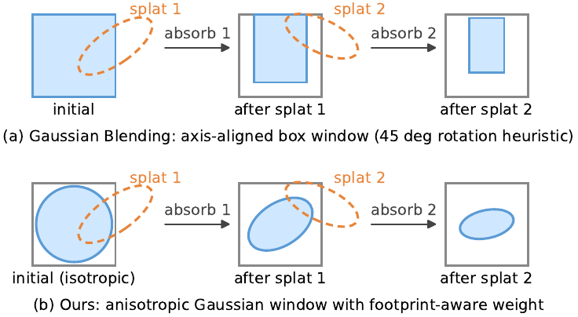
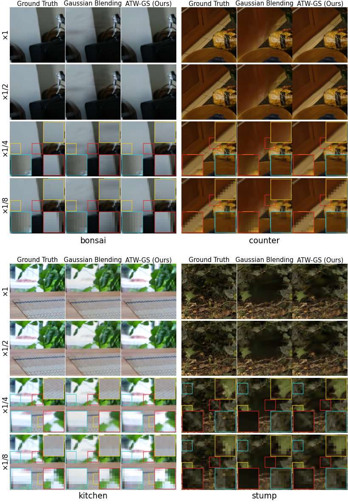

<div align="center">

# ATW-GS

### Anisotropic Transmittance Windows for Anti-Aliased 3D Gaussian Splatting

<p>
<a href="#">

</a>
<a href="https://hanalebeta.github.io/ATW_GS/">

</a>
<a href="#">

</a>
<a href="LICENSE">

</a>
</p>

Hana L. Goshu<sup>1</sup>, Tadesse G. Wakjira<sup>2</sup>, Kin-Man Lam<sup>1</sup>

<sup>1</sup>The Hong Kong Polytechnic University &nbsp;&nbsp; <sup>2</sup>Kennesaw State University

*Preprint, 2026 (Under Review)*

</div>

---

## Method

<div align="center">

<br>
<em>ATW-GS propagates an anisotropic Gaussian transmittance window (centre, 2&times;2 covariance, mass) through front-to-back composition, preserving splat orientation within each pixel.</em>
</div>

---

<div align="center">

<br>
<em>Multi-scale comparison on Mip-NeRF 360: ATW-GS suppresses the dilation that 3D Gaussian Splatting exhibits at sampling rates unseen during training, while preserving quality at the training rate.</em>
</div>

---

## Abstract

3D Gaussian Splatting (3DGS) enables real-time novel view synthesis but suffers from aliasing artifacts when rendered at sampling rates that differ from those used during training. Existing anti-aliasing methods mitigate this issue by prefiltering Gaussian primitives or integrating their response over the pixel area; however, they rely on scalar alpha composition, which treats per-pixel transmittance as a single value and therefore discards the spatial structure within each pixel. More recent spatially aware approaches maintain a per-pixel transmittance window, but represent it as an axis-aligned box, preventing the model from capturing the true orientation of projected splats. To address this limitation, we propose **Anisotropic Transmittance Windows for 3D Gaussian Splatting (ATW-GS)**, which models per-pixel transmittance as a full covariance Gaussian that preserves splat orientation throughout the front-to-back composition sequence. Furthermore, ATW-GS computes each splat's contribution weight using the exact error-function integral of the pixel footprint projected onto the window's marginal axes. This ensures that consistency between the anisotropic window state and the per-splat weight computation. Extensive experiments on the NeRF Synthetic (Blender) and Mip-NeRF 360 datasets demonstrate that ATW-GS consistently outperforms state-of-the-art aliasing methods across both single-scale and multi-scale evaluation regimes.

## Code

The code will be released upon acceptance of the paper.

## Citation

```bibtex
@inproceedings{atwgs2026,
  title     = {ATW-GS: Anisotropic Transmittance Windows for Anti-Aliased 3D Gaussian Splatting},
  author    = {Goshu, Hana L. and Wakjira, Tadesse G. and Lam, Kin-Man},
  year      = {2026},
  note      = {Under Review}
}
```

## Acknowledgements

This work builds on 3D Gaussian Splatting and related anti-aliasing and spatially-aware composition methods. We thank the authors for releasing their work.

## License

Released under the [MIT License](LICENSE).
